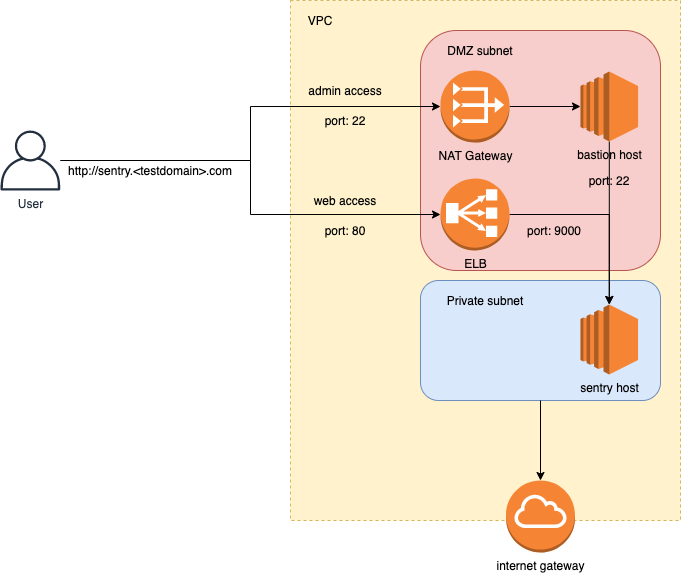

# Intro

## Short Info

In different settings I would have chosen: "eks/helm/let's encrypt/nginx ingress", but as the tasks was to write infrastructure  - I settled with more basic approach.

I've include bastion host and basic security. Main reason:  I thought that this would be important in context of job position and what you were looking for.

Basic project structure:

* Vpc
* 2 EC2 instances(bastion, sentry)
* Security groups/roles
* Elb
* Internal zone and public dns record in zone specified by user.

## Diagram



## Requirements

To run this you will need:

* terrafrom
* terragrunt
* cmake
* AWS account

## Getting started

1. Open project in your favorite terminal
2. Update ***common.tfvars*** with your environment variables

```shell
aws_key_name = "key" # AWS private key used for ec2 instances
root_domain  = "domain.com" # Change to domain under which you would like to create public dns record for sentry
cluster_name = "cluster-name" # Name that will be shared across all the AWS resources tags 
cidr_block   = "10.0.0.0/16" # VPC CIDR block 
sentry_email = "test@testsentry.com" # Sentry login email
sentry_pass  = "4CvLgVFY5xu%wmc*6Z^^" # Sentry login password
```

3. Update ***terragrunt.hcl*** update s3 bucket name and region where it should be located

4. Sentry deployment will use your default AWS profile/region, to override that set as env variables.

```shell
export AWS_PROFILE=profile
export AWS_REGION=region
```

5. To deploy sentry run command below. _Deployment might take around 10min for everything to be ready_

```shell
make stage-deploy
```

6. Wait for deployment to finish and check terminal for outputs

7. To undeploy application run:

```shell
make stage-undeploy
```

8. Delete S3 bucket after finished with the task